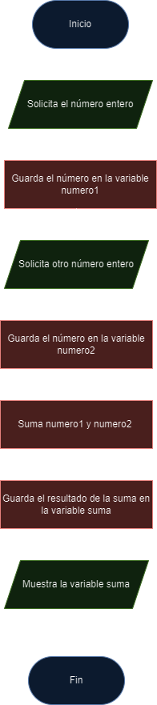

# 🤓 Algoritmos
>Creado por: Rodrigo Hernández para el laboratorio de Introducción a la Programación y Computación 1.

Este archivo es de utilidad para refrescar los conocimientos de algoritmos y su uso en la programación.

## ¿Qué es un algoritmo?
Un algoritmo es un conjunto de instrucciones o reglas definidas y no ambiguas, ordenadas y finitas que permite solucionar un problema o realizar una actividad en un tiempo finito.

## Ejemplo de un algoritmo
El siguiente algoritmo es un ejemplo de un algoritmo para calcular la suma entre dos números.
> #### Algoritmo para la suma de dos números
> 1. Inicio
> 2. Solicito un número entero
> 3. Guardo el número solicitado en el paso 2 en una variable llamada numero1
> 4. Solicito otro número entero
> 5. Guardo el número solicitado en el paso 4 en una variable llamada numero2.
> 6. Sumo los números guardados en las variables numero1 y numero2 y guardo el resultado en una variable llamada suma.
> 7. Muestro el resultado de la suma.
> 8. Fin

## Características de un algoritmo

- **Precisión**: Las instrucciones deben ser claras y precisas.
- **Definición**: Debe estar definido para resolver un problema.
- **Finitud**: Debe tener un número finito de pasos.

## Diagrama de flujo
Un diagrama de flujo es una representación gráfica de un algoritmo. Los diagramas de flujo son una forma de representar visualmente el flujo de datos a través de sistemas de procesamiento de información.

### Símbolos de un diagrama de flujo
- **Inicio/Fin**: También conocido como "símbolo terminador", este símbolo representa el punto de inicio, el punto de fin y los posibles resultados de un camino. A menudo contiene las palabras "Inicio" o "Fin" dentro de la figura.
    

- **Proceso**: También conocido como "símbolo de acción", esta figura representa un proceso, una acción o una función. Es el símbolo más ampliamente usado en los diagramas de flujo.
    

- **Documento**: Más específicamente, representa la entrada o la salida de un documento. Algunos ejemplos de entradas son recibir un informe, un mensaje de correo electrónico o un pedido. Algunos ejemplos de salida que usan un símbolo de documento incluyen generar una presentación, un memo o una carta.
    

- **Decisión**: Indican una pregunta que debe responderse —por lo general sí/no o verdadero/falso. El camino del diagrama de flujo puede dividirse en diferentes ramas, según la respuesta o las consecuencias que se sucedan.
    

- **Conector**: Por lo general, este símbolo se emplea en los diagramas más complejos y conecta elementos separados en una página.
    

- **Flecha de flujo**: Indica la dirección del flujo del proceso.
    

- **Conector/enlace fuera de página**: Frecuentemente se emplea en los diagramas más complejos para conectar elementos separados en múltiples páginas, con el número de página colocado sobre o dentro de la propia figura para una referencia sencilla.
    

- **Entrada/Salida**: Esta figura, que también se conoce como "símbolo de datos", representa los datos que están disponibles como entrada o salida, y también representa los recursos empleados o generados. A pesar de que el símbolo de la cinta de papel también representa la entrada/salida, está obsoleto y ya no se usa en los diagramas de flujo.
    

- **Comentario o nota**: Este símbolo, empleado junto con contexto, agrega una explicación o comentarios necesarios dentro de un rango específico. También puede conectarse mediante una línea discontinua a la sección correspondiente del diagrama de flujo.
    

## Ejemplo de diagrama de flujo
El siguiente diagrama de flujo es un ejemplo de un diagrama de flujo para calcular la suma entre dos números.

## Ejercicios de ayuda para resolver algoritmos

### 🍕 Ejercicio 1
Diseñar un algoritmo para preparar una pizza desde cero. Definir los ingredientes, cuál será el sabor y la preparación.

> Si quieres la solución, lo puedes encontrar acá: [Solución 1](https://github.com/rodrialeh01/core-code-from-scratch-readme/blob/main/Week%201/README.md)

### 🤒 🧊 🔥 Ejercicio 2
Defina un algoritmo que sea capaz de convertir temperaturas de Celsius a Fahrenheit y viceversa.

> Si quieres la solución, lo puedes encontrar acá: [Solución 2](https://github.com/rodrialeh01/core-code-from-scratch-readme/blob/main/Week%201/README.md)

### 📐 Ejercicio 3
Diseñar un algoritmo que permita calcular el volumen de una pirámide, un cubo y una esfera.

> Si quieres la solución, lo puedes encontrar acá: [Solución 3](https://github.com/rodrialeh01/core-code-from-scratch-readme/blob/main/Week%201/README.md)

### 📈 Ejercicio 4
Diseña un algoritmo que pueda validar si un número es par o impar. Si el número es par tiene que mostrar un mensaje que diga _"Este número es par"_, de lo contrario tiene que mostrar _"Este número es impar"_. Además realiza el diagrama de flujo de este algoritmo.

> Si quieres la solución, lo puedes encontrar acá: [Solución 4](https://github.com/rodrialeh01/core-code-from-scratch-readme/blob/main/Week%201/README.md)

### 👴 Ejercicio 5
Diseñar un algoritmo que permita calcular la edad de una persona a partir de su año de nacimiento. Además realiza el diagrama de flujo de este algoritmo.

> Si quieres la solución, lo puedes encontrar acá: [Solución 5](https://github.com/rodrialeh01/core-code-from-scratch-readme/blob/main/Week%201/README.md)

### 🥛 Ejercicio 6

Diseña un algoritmo que describa la preparación de un cereal con leche. Representalo también con diagramas de flujo.

> Si quieres la solución, lo puedes encontrar acá: [Solución 6](https://github.com/rodrialeh01/core-code-from-scratch-readme/blob/main/Week%202/README.md)