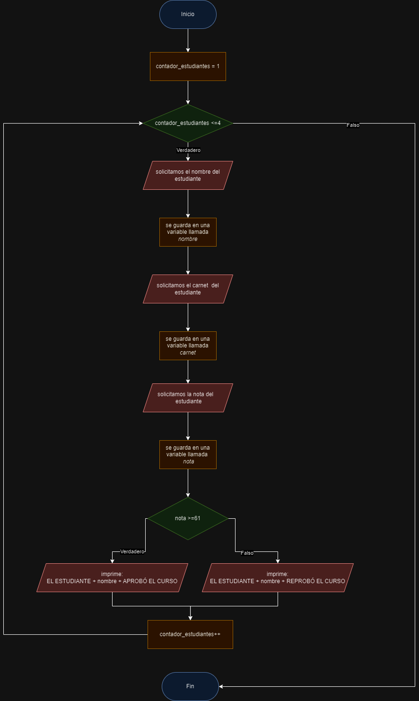

# ☕ Unidad 1: Fundamentos de Programación y JAVA

## ⭐️ Clase 1: Introducción a la Programación con Java

_Fecha: 26-01-2024_

Es el comienzo de una introduccion muy extensa de JAVA, puede ser mucho contenido para un primer dia, pero es lo básico que deben de saber para programar de aqui en adelante.

### Contenido
- ¿Qué es Java?
- Versiones y Ambiente de Java (JDK, JRE, JVM).
- Características de Java
- Comentarios de una línea y multilínea 
- Variables
- Declaración y asignación de variables
    - Tipos Primitivos y No Primitivos
        - int
        - float
        - double
        - char
        - boolean
        - String
- Casteos Implicitos y Explicitos
- Operadores 
    - Aritméticos
    - Relacionales
    - Lógicos
    - Prioridad entre operadores
- Input y output
- Estructuras de Control
    - if, else if, else
    - switch
- Ciclos
    - for
    - while
    - do - while
- Procedimientos (Métodos)
- Funciones
- Recursividad

### 🎥 Grabación de la Clase
**Clase 1**: [https://drive.google.com/file/d/1Q78HPSYR8ZfXV1S4CXYWq_xVr70YuNsH/view?usp=sharing](https://drive.google.com/file/d/1Q78HPSYR8ZfXV1S4CXYWq_xVr70YuNsH/view?usp=sharing)

### 💻 Código de la Clase

Lo puedes encontrar en:  [Clase01/src/clase01/Clase01.java](./Clase01/src/clase01/Clase01.java)

## 🌟 Clase Extra 1: Algoritmos, Diagramas de Flujo y Pseudocódigo

En esta clase se dió la continuación a la explicación de métodos y funciones, junto con la recursividad, además se reforzaron los conceptos de algoritmos, diagramas de flujo y pseudocódigo.

### Contenido
- Procedimientos (Métodos)
- Funciones
- Recursividad
- Algoritmos
- Diagramas de Flujo
- Pseudocódigo

### 🎥 Grabación de la Clase
**Clase Extra 1**: [https://drive.google.com/file/d/1h2M45PxY4ettaV_b-0dGeZE7fGdwo6-S/view?usp=sharing](https://drive.google.com/file/d/1h2M45PxY4ettaV_b-0dGeZE7fGdwo6-S/view?usp=sharing)

### 💻 Código de la Clase

#### Métodos, Funciones y Recursividad
Lo puedes encontrar en:  [ClaseExtra1/src/claseextra1/ClaseExtra1.java](./ClaseExtra1/src/claseextra1/ClaseExtra1.java)

#### Algoritmos

Puedes encontrar más información detallada en el archivo [Algoritmos.md](./Algoritmos.md)

Además el ejemplo realizado en clase es el siguiente:

> ## Caso:
> Se requiere que se haga el ingreso de notas de 4 estudiantes, tiene que validar que si la nota es mayor o igual a 61 entonces se mostrará el mensaje de "EL ESTUDIANTE <<NOMBRE>> APROBÓ EL CURSO", sino mostrará el mensaje de "EL ESTUDIANTE <<NOMBRE>> REPROBÓ EL CURSO". Para ingresar las notas, se solicitarán los siguientes datos: Nombre del estudiante, Carnet del estudiante y Nota del estudiante.

Entonces la solución dada del algoritmo es el siguiente:

```markdown
ALGORITMO PARA INGRESAR NOTAS DE ESTUDIANTES

1. inicio
2. crea una variable llamada contadorestudiantes con valor de 1
3. se valida que el contadorestudiantes sea menor o igual a 4.
4. si el paso 3 es verdadero entonces se pide el nombre del estudiante, sino pasa al paso 15
5. se guarda el valor solicitado en el paso 4 en una variable llamada nombre
6. se pide el carnet del estudiante
7. se guarda el valor solicitado en el paso 6 en una variable llamada carnet
8. se pide la nota del estudiante
9. se guarda el valor solicitado en el paso 8 en una variable llamada nota
10. si la variable nota es mayor o igual a 61 entonces pasa al paso 11, sino pasa al paso 12
11. se muestra el mensaje "EL ESTUDIANTE " luego la variable nombre y por ultimo " APROBÓ EL CURSO".
12. se muestra el mensaje "EL ESTUDIANTE " luego la variable nombre y por ultimo " REPROBÓ EL CURSO".
13. se incrementa el valor de la variable contadorestudiantes en 1
14. regresa al paso 3.
15. fin.
```

#### Diagramas de flujo

Puedes encontrar más información detallada en el archivo [Pseudocódigo.md](./Pseudocódigo.md)

Además el ejemplo realizado en clase es el siguiente:

<div align="center"></div>

Además si quieres el archivo editable, lo puedes encontrar en el siguiente [enlace](https://drive.google.com/file/d/1mRNSZcYK547Qi-wN9PGZlBtz50lVugRn/view?usp=sharing)

#### Pseudocódigo

Puedes encontrar más información detallada en el archivo [Pseudocódigo.md](./Pseudocódigo.md)

Además el ejemplo realizado en clase es el siguiente:

```python
Proceso Ingreso_nota_estudiantes
	Definir contador_estudiantes Como Entero;
	Definir nombre Como Cadena;
	Definir carnet Como Cadena;
	Definir nota Como Entero;
	contador_estudiantes <- 1;
	Mientras contador_estudiantes <= 4 Hacer
		Escribir "Ingrese el nombre del estudiante";
		Leer nombre;
		Escribir "Ingrese el carnet del estudiante";
		Leer carnet;
		Escribir "Ingrese la nota del estudiante";
		Leer nota;
		Si nota >=61 Entonces
			Escribir "EL ESTUDIANTE ", nombre ," APROBÓ EL CURSO";
		SiNo
			Escribir "EL ESTUDIANTE ", nombre ," REPROBÓ EL CURSO";
		FinSi
		contador_estudiantes <- contador_estudiantes + 1;
	FinMientras
FinProceso
```

Tambien puedes usar el archivo para abrirlo en PSeInt que está en [EjemploPseint/Ingreso_nota_estudiantes.psc](./EjemploPseint/Ingreso_nota_estudiantes.psc)

## ⭐️ Clase 2: Manejo de Memoria y archivos de texto plano

_Fecha: 02-08-2024_

En esta clase se explicará el manejo de memoria en Java, además de la creación, lectura, escritura y cierre de archivos de texto plano.

### Contenido
- Memoria
- Memoria estática
	- Arreglos
	- Matrices
- Memoria dinámica
    - LinkedList
	- ArrayList
- Manejo de Archivos
	- Creación
	- Lectura
	- Escritura
	- Cierre

### 🎥 Grabación de la Clase
**Clase 2**: [https://drive.google.com/file/d/1HTsUnJFGtsMBhVI5j1UPJQbPCgLQ-7Z8/view?usp=sharing](https://drive.google.com/file/d/1HTsUnJFGtsMBhVI5j1UPJQbPCgLQ-7Z8/view?usp=sharing)

### 💻 Código de la Clase

Lo puedes encontrar en:  [Clase02](./Clase02)

Puedes encontrar más contenido acerca del manejo de memoria en el siguiente [enlace](./ManejoDeMemoria.md).

También puedes encontrar una parte explicada del manejo de archivos en el siguiente [enlace](./ManejoDeArchivos.md).

## 🌟 Explicación Extra 2: Libreria Random

En esta clase se dió una explicación del funcionamiento de la libreria random.

### Contenido
- Libreria Random
- Generación de números aleatorios en un rango específico

### 🎥 Grabación de la Clase
**Explicación Extra 2**: [https://drive.google.com/file/d/1CyQUt1h6gzZjUkhxDowLpFTz618M8cL2/view?usp=sharing](https://drive.google.com/file/d/1CyQUt1h6gzZjUkhxDowLpFTz618M8cL2/view?usp=sharing)

### 💻 Código de la Clase

```java

import java.util.Random;
/**
 *
 * @author rodri
 */
public class Extra {

    /**
     * @param args the command line arguments
     */
    public static void main(String[] args) {
        int num_inicio = 2;
        int num_final = 13;
        //RANDOM = FINAL-INICIO +1 = 13-2 = 11+1 0,1,2,3,4,5,6,7,8,9,10,11
        //RANDOM = 0
        // 0+2
        //2
        int numrandom = new Random().nextInt(num_final - num_inicio +1) + num_inicio;
    }
    
}

```

### Explicación del código anterior

En el código anterior se muestra como se puede generar un número aleatorio en un rango específico, en este caso se generará un número aleatorio entre 2 y 13.

```java
int num_inicio = 25;
int num_final = 35;
```

Luego se aplica una formula del rango de numeros aleatorios:

```java
int formula = num_inicio - num_final +1
```

Esto quiere decir que hará lo siguiente: generar numeros aleatorios sin incluir el num_final osea: `num_inicio - num_final`, pero agregamos el `+1` para que incluya el num_final.

Para este caso la formula daría lo siguiente:

```java
int formula = 35 - 25 + 1
```

```java
int formula = 11
```

Y como se puede apreciar, el 11 no esta dentro del rango entre 35 y 25, entonces procede a hacerse lo siguiente:

```java
int numrandom = new Random().nextInt(formula);
```
Esto quiere decir que el programa generará un número aleatorio desde 0 hasta que sea menor que 11.

```java
int numrandom = new Random().nextInt(formula) + num_inicio;
```
Esto quiere decir que el programa generará un número aleatorio desde 0 hasta que sea menor que 11 y luego le sumará el num_inicio, entonces el número aleatorio generado estará entre 25 y 35.

Ejemplo:

```java
int numrandom = new Random().nextInt(11) + 25;
```
Esto generará un número aleatorio entre 25 y 35.
