# 😼 Git
>Creado por: Rodrigo Hernández para el laboratorio de Introducción a la Programación y Computación 1.

## ¿Qué es Git?
Git es un proyecto de código abierto maduro y con un mantenimiento activo que desarrolló originalmente Linus Torvalds. Un asombroso número de proyectos de software dependen de Git para el control de versiones, incluidos proyectos comerciales y de código abierto. Los desarrolladores que han trabajado con Git cuentan con una buena representación en la base de talentos disponibles para el desarrollo de software, y este sistema funciona a la perfección en una amplia variedad de sistemas operativos e IDE.

## Comandos básicos para usar git

### Clonar un repositorio
```bash
$ git clone <url>
```
Ejemplo:
```bash
$ git clone https://github.com/rodrialeh01/IPC1A-2S2024
```

### Añadir cambios
Este comando agrega todos los cambios realizados en el proyecto.
```bash
$ git add .
```
Ejemplo:
```bash
$ git add .
```

### Verificar estado de los archivos
Este comando muestra los archivos que han sido modificados.
```bash
git status
```
Ejemplo:
```bash
$ git status
```
### Realizar un commit
Este comando guarda los cambios realizados en el proyecto.
```bash
$ git commit -m "mensaje"
```
Ejemplo:
```bash
$ git commit -m "Agregando cambios al proyecto"
```
### Subir los cambios guardados al repositorio remoto

Este comando sube los cambios realizados al repositorio remoto.
```bash
$ git push
```

Ejemplo:
```bash
$ git push
```

### Obtener los cambios actualizados desde el repositorio remoto
Este comando obtiene los cambios realizados en el repositorio remoto.
```bash
$ git pull
```
Ejemplo:
```bash
$ git pull
```

### Verificar el historial de cambios
Este comando muestra el historial de cambios realizados en el proyecto.
```bash
$ git log
```

Ejemplo:
```bash
$ git log
```

### Crear una rama
Este comando crea una rama en el proyecto.
```bash
$ git branch <nombre_rama>
```
Ejemplo:
```bash
$ git branch rama1
```
### Cambiar a una rama
Este comando cambia a una rama en el proyecto.
```bash
$ git checkout <nombre_rama>
```
Ejemplo:
```bash
$ git checkout rama1
```
### Fusionar una rama
Este comando fusiona una rama con la rama principal.
```bash
$ git merge <nombre_rama>
```
Ejemplo:
```bash
$ git merge rama1
```
### Eliminar una rama
Este comando elimina una rama en el proyecto.
```bash
$ git branch -d <nombre_rama>
```
Ejemplo:
```bash
$ git branch -d rama1
```
### Subir cambios a un repositorio remoto
Este comando sube los cambios realizados en una rama al repositorio remoto.
```bash
$ git push origin <nombre_rama>
```
Ejemplo:
```bash
$ git push origin rama1
```
### Verificar las ramas
Este comando muestra las ramas que existen en el proyecto.
```bash
$ git branch
```
Ejemplo:
```bash
$ git branch
```
### Verificar las ramas remotas
Este comando muestra las ramas remotas que existen en el proyecto.
```bash
$ git branch -r
```
Ejemplo:
```bash
$ git branch -r
```
### Verificar las ramas locales y remotas
Este comando muestra las ramas locales y remotas que existen en el proyecto.
```bash
$ git branch -a
```
Ejemplo:
```bash
$ git branch -a
```

## Github
GitHub es una forja para alojar proyectos utilizando el sistema de control de versiones Git. Se utiliza principalmente para la creación de código fuente de programas de ordenador. El software que opera GitHub fue escrito en Ruby on Rails.

A un alto nivel, GitHub es un sitio web y un servicio basado en la nube que ayuda a los desarrolladores a almacenar y administrar su código, así como a rastrear y controlar los cambios en su código.

### Crear un repositorio en GitHub
1. Ingresar a la página de [GitHub](https://github.com/).

2. Iniciar sesión con tu cuenta de GitHub.

3. Selecciona el botón verde de "New" en:

```url
https://github.com/<tu_user_de_github>?tab=repositories
```


4. Llena los siguientes campos:
- Nombre del repositorio: No debe de contener espacios en blanco y puede aceptar .,_,-,letras y números.
- La descripción es opcional.
- Selecciona si el repositorio será público o privado.
- Selecciona si deseas agregar un archivo README.md.
- Puedes seleccionar una plantilla de `.gitignore` para un lenguaje en especifico.
- Puedes seleccionar una plantilla de `LICENSE` para un tipo de licencia en especifico.

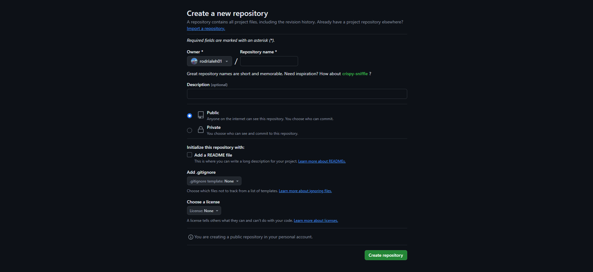

5. Selecciona el botón verde de "Create repository".

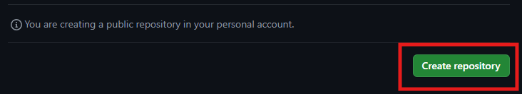

6. Listo!, ya creaste tu primer repositorio remoto.

### Cambiar el nombre del repositorio

1. Ingresa al repositorio que deseas cambiar el nombre.

2. Selecciona el botón de "Settings".

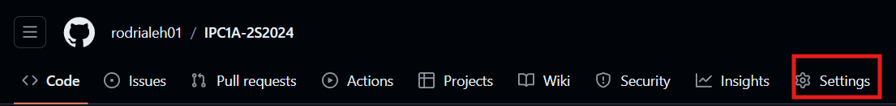

3. En la sección de "Repository name" cambia el nombre del repositorio.


4. Selecciona el botón "Rename"

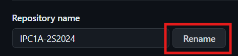

5. Listo!, ya cambiaste el nombre de tu repositorio.

### Agregar colaboradores al repositorio

1. Ingresa al repositorio al que deseas agregar colaboradores.

2. Selecciona el botón de "Settings".


3. Selecciona la opción de "Collaborators".

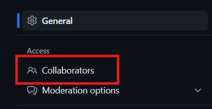

4. Ingresa tu contraseña para verificar tu identidad.

5. Selecciona el botón de "Add people".

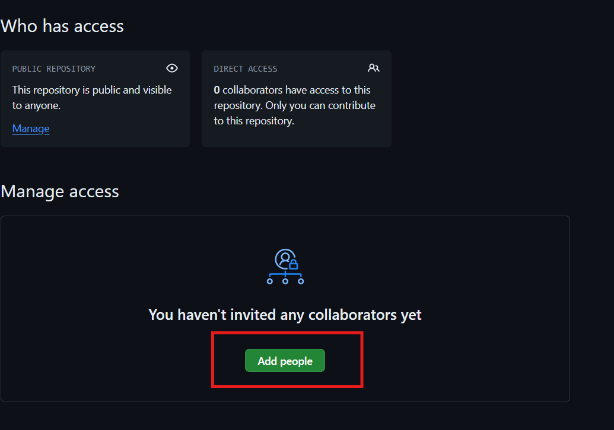

6. Ingresa el nombre de usuario o el correo electrónico de la persona que deseas agregar como colaborador.

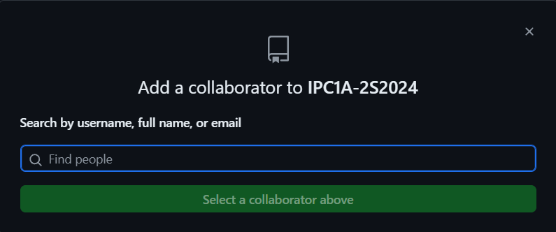

7. Selecciona el usuario.

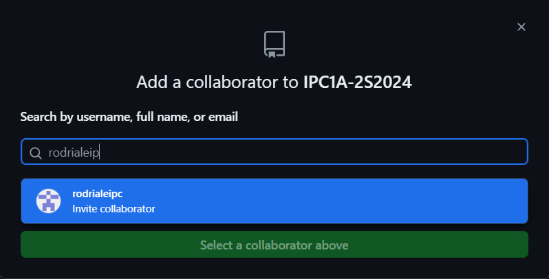

8. Presiona el boton verde de "Select <nombre_de_usuario> to this repository".

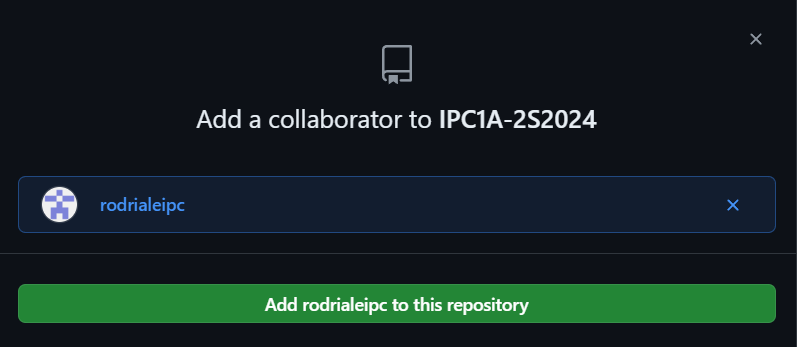

9. Listo!, ya agregaste un colaborador a tu repositorio.

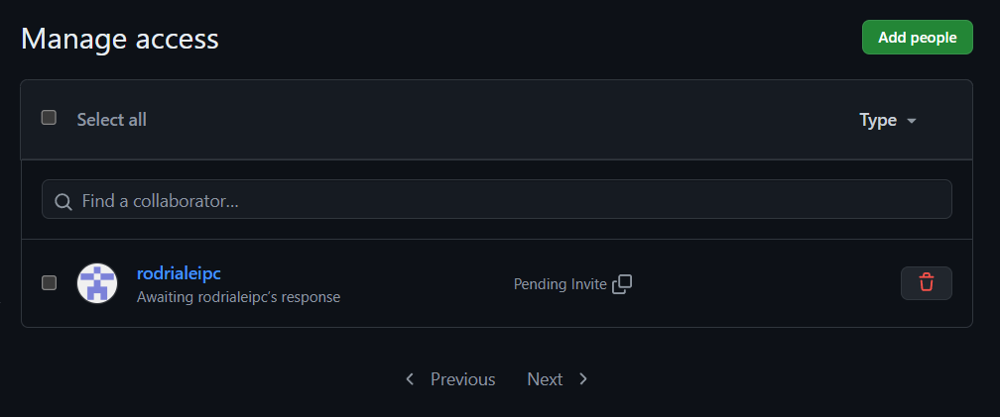

> Nota: La persona a quien invitaste a tu repositorio te tiene que aceptar.

10. Si la persona aceptó tu repositorio tiene que aparecer como "Collaborator".

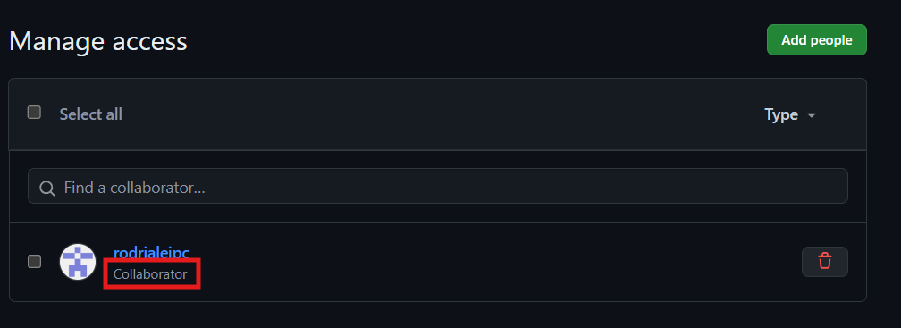

### Aceptar de colaborador a un repositorio que invitaste

1. Ingresa a tu bandeja de entrada.


2. Tiene que llegar una invitación como esta:


3. Dale click a la invitación.

4. Selecciona el botón "Accept invitation".


5. Listo!, ya aceptaste la invitación a colaborar en un repositorio.

